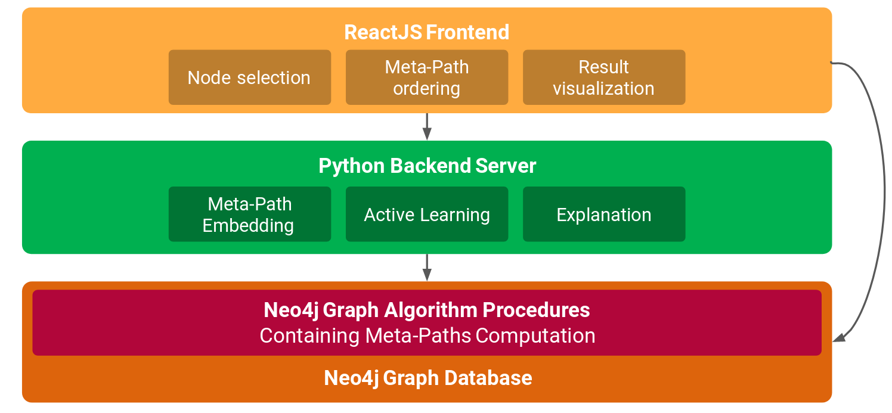
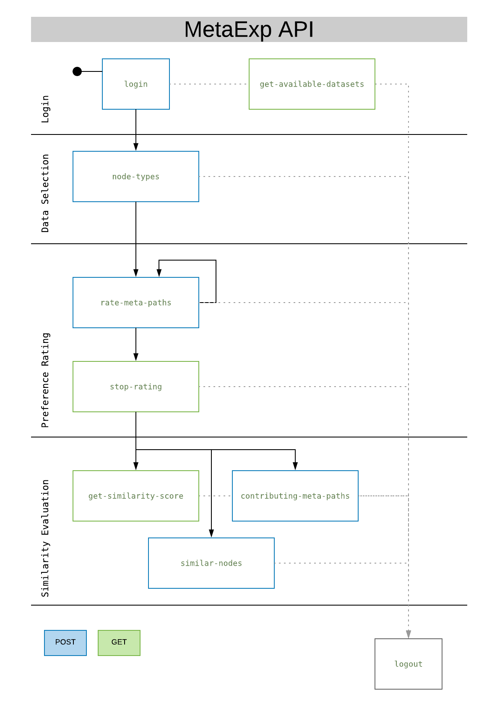

# MetaExp: Interactive Explanation and Exploration of Large Knowledge Graphs

## TODO Picture

## Motivation

We present MetaExp, a system that assists the user during the
exploration of large knowledge graphs, given two sets of initial
nodes. At its core, MetaExp presents a small set of meta-paths to the
user, which are sequences of relationships among node types. Such
meta-paths do not overwhelm the user with complex structures, yet
they preserve semantically-rich relationships in a graph. MetaExp
engages the user in an interactive procedure, which involves simple
meta-paths evaluations to infer a user-specific similarity measure.

More information can be found in the [paper](resources/paper.pdf), [slides](resources/presentation.pdf) and the [poster](resources/poster.pdf).

## TODO  Deployment

### Requirements
Our deployment is based on several docker containers, please install docker: [Mac](https://docs.docker.com/docker-for-mac/install/), 
[Windows](https://docs.docker.com/docker-for-windows/install/) and 
[Ubuntu](https://docs.docker.com/engine/installation/linux/docker-ce/ubuntu/).

### Graph Database
A - Neo4j is already running
B - New Neo4j Instance
 mvn clean install
 kopiert in plugins ordner
### Python
- start sockercontainer
- redis server deployen
- test_import route callen
### UI
To build your own local code use `deployment/build-ui.sh /path/to/code` (e.g. `deployment/build-ui.sh .`), 
set the environment variable `REACT_APP_API_HOST` according to you API (e.g. export `REACT_APP_API_HOST=[API Endpoint]`) and 
to run a single container `deployment/run-ui.sh [PORT]` (e.g. ./deployment/run-dev-ui.sh).

## System Architecture

small description

### [ReactJS UI](https://github.com/MetaExp/frontend)

Cross-Browser Usablity: Use Mozilla Firefox. Input range slider-thumb styling only works with Firefox
Architectural Approach: [Flux-Pattern](https://facebook.github.io/flux/docs/in-depth-overview.html#content)

Following, according to the Flux-Pattern, we describe the API-Communication, the most important stores and components and to which stores, i.e. data changes, they listen to and which actions they trigger.

#### API-Communication

- /src/utils/MetaPathAPI.js holds all relevant actions regarding API-Communication
- Actions provided according to each component's functionality
- process.env.REACT_APP_API_HOST React env-variable holds API-Endpoint

#### Stores

- AccountStore: Stores data regarding login information, e.g. username, chosen dataset, login state
- AppStore: Navigation data, like current page and previous and next page (footer navigation)
- SetupStore: Data of setup page, i.e. chosen node sets, cypher queries for neo4j graph visualization through forked third party [neo4j-graph-renderer](https://github.com/jbitton/neo4j-graph-renderer/pull/7)
- ExploreStore: Meta-Paths and rating information, chosen rating interface, batch size
- ResultStore: Holds explanatory data as a similarity score, top-k contributing meta-paths and additional meta-path information

#### Components

Main Parts: Setup page, Explore page, Result page

##### Setup Page

- SearchNodesSection: Component for executing a cypher query in CypherEditor-Component with syntax highlighting and auto-completion
- ResultSetSection: Component for visualizing query response and selecting node candidates for both node sets
- NodeSetsSection: Component for visualizing both selected candidate node sets and saving them

##### Explore Page

- MetaPathDisplay: General Component for displaying meta-path batches and rating scala, handling their rating change , batch size and rating interface change, displaying refrence meta-paths over all batches
- MetaPath: Textual visualization of meta-path
- MetaPathRater: Input range slider for rating a certain meta-path
- IndividualRatingInterface: Table with meta-path and absolute rating slider for each meta-path
- CombinedRatingMetaPathTable: Table with Meta-Path ID Button, which can be clicked to add Meta-Path to batch-global relative rating slider

##### Result Page

- SimilarityScore: Component for displaying initially chosen node sets and a score for their similarity or 'connectedness'
- ContributingMetaPaths: Component for visualizing a pie chart, that holds information abut how much each of the top-k meta-paths contribute to the similarity score
- MetaPathDetails: Component for displaying details of a certain meta-path, i.e. structural and domain value and exemplary meta-path instances

### [Python Flask API and Algorithmic Backend](https://github.com/MetaExp/backend)

#### Overview
The python backend is structured into several components, each is responsible for either serving the api or part of the algorithmic backbone. The algorithmic parts are in their basic functionality. Work on the individual components is conducted outside of the MetaExp-Project, but might be referenced here in the future.

- Serving Modules
  - `server` : Serve API endpoints with a flask/gunicorn server
  - `redis_own` : Provide access to a redis database where node embeddings are stored
  - `neo4j_own` : Connector to the neo4j database
- Algorithmic Modules
  - `active_learning` : Provide active learning functionality for interactively learning a preference model of meta-paths
  - `domain_scoring` : Calculate the similarity of two node sets given a preference over meta-paths
  - `embeddings` : Compute vector-embeddings of MetaPaths
  - `explaination` : Explain the similarity score

#### API

The API is not stateless, the image below describes the process of interating with the API.
Users need to login to the system for a specific dataset.
This is followed by the input-set selection and then the iterative rating of paths.
Finally the user can view the similarity.
These phases are sequential. 
Since this is a prototype, it is likely that the system will crash if they are called arbitrarily.

#### API endpoints

- **`get-available-datasets`**
  - Returns a list of all available neo4j-datasets in the backend.
  - *IN* `None`
  - *OUT* `{[dataset1, dataset2, ...]}`

- **`login`**
  - Login into the system.
  - *IN* `{'username': username, 'dataset': datasetname, 'purpose': purpose_of_similarity}`
  - *OUT* `{'status': 200}`
 
- **`node-types`**
  - Select the input node types for both sets for the algorithm.
  - *IN* `{'start_label': label_of_start_node, 'end_label': label_of_end_node, 'start_node_ids': list_of_node_ids, 'end_node_ids': list_of_node_ids}`
  - *OUT* `{'status': 200}`
  
- **`next-meta-paths/<int:batch_size>`**
  - Retrieve the next batch_size MetaPaths that should be labelled by the user.
  - *IN* `None`
  - *OUT* `{'metapaths': [path1, path2, ... ], 'next_batch_available': bool}`

- **`rate-meta-paths`**
  - Send metapaths that have been rated.
  - *IN* `{'meta_paths': [{'id': 3,
                   'metapath': ['Phenotype', 'HAS', 'Association', 'HAS', 'SNP', 'HAS', 'Phenotype'],
                   'rating': 0.75},...],
    'min_path':{'id': ,...},
    'max_path':{'id': ,..}}`
  - *OUT* `{'status': 200}`
 
- **`stop-rating`**
  - Finish the rating process.
  - *IN* `None`
  - *OUT* `{'status': 200}`

- **`get-similarity-score`**
  - Retrieve the similarity score for the previously defined node sets and preferences.
  - *IN* `None`
  - *OUT* `{'similarity_score': score}`

- **`contributing-meta-paths`**
  - Retrieve the most contributing MetaPaths for this similarity score.
  - *IN* `None`
  - *OUT* `{'contributing_meta_paths': [pie_chart_vis1,...]}`

- **`similar-nodes`**
  - Retrieve the most similar nodes to those in the set.
  - *IN* `None`
  - *OUT* `{'similar_nodes': [node1, node2,...]}`

- **`logout`**
  - Logout of the system.
  - *IN* `None`
  - *OUT* `{'status': 200}`
 
### [Neo4j Graph Algorithms](https://github.com/MetaExp/neo4j-graph-algorithms)
- hinzugefügte procedures, input output, purpose

### [Neo4j Graph Renderer](https://github.com/MetaExp/neo4j-graph-renderer)

Forked and extended third party react component for visualizing neo4j graphs and interact with the nodes.

## Contributors
Freya Behrens, Sebastian Bischoff, Pius Ladenburger, Julius Rückin, Laurenz Seidel, Fabian Stolp, Michael Vaichenker and Adrian Ziegler.

## Acknowledgments
This work was conducted with our project partners [neo4j](https://neo4j.com), [helmholz zentrum münchen](https://www.helmholtz-muenchen.de/) and [knowing health](https://knowing-health.com/).

## License
All work is licensed under [MIT License](LICENSE.md).
